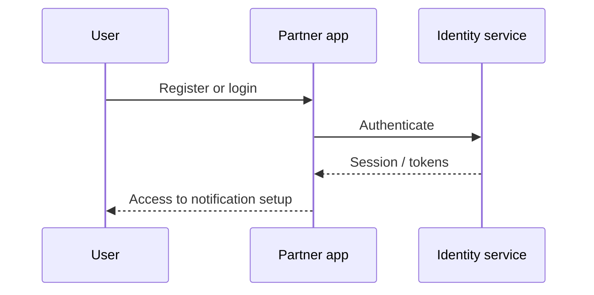

# Login and register

Documents partner-facing registration and authentication so users can manage notification configuration.

## Scope (draft)

- **Registration** — Organization name, primary contact email, supporting metadata, terms/consent as required.
- **Login** — Access to existing org configuration and notification setup.
- **Session / identity** — Patterns (e.g. OIDC, native sessions) to be aligned with platform security docs later.

## Relationship to onboarding

Registration may coincide with or precede full **partner onboarding**; clarify whether one journey or two (see [partner onboarding](../partner-onboarding/index.md)).

## Diagrams

Auth and session flows appear under [level 2 sequences](../technical-flows/level-2/l2-login-register.md) when ready.

### Placeholder (inline Mermaid)

