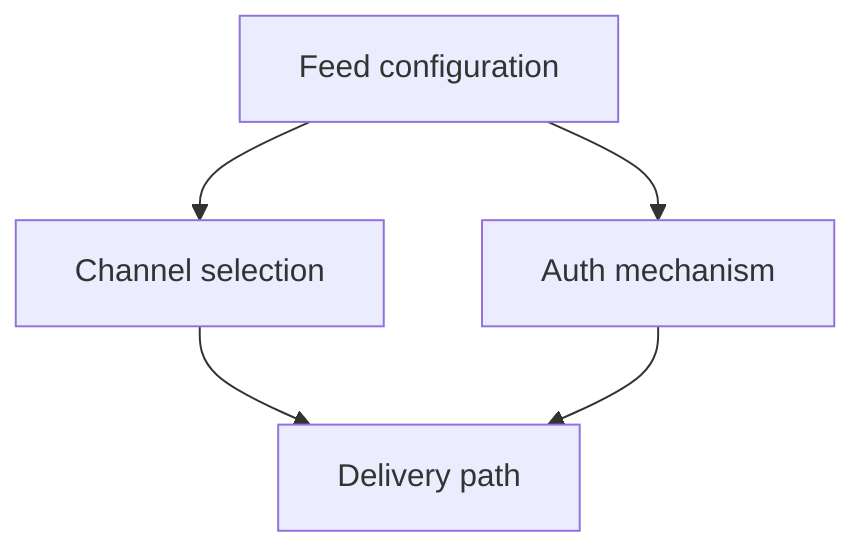

# Notification (feed) setup

Documents how a partner defines notification feeds: channels, delivery options, and outbound authentication.

## Scope (draft)

- **Channels** — Email, push, webhook, SMS, in-app, … (canonical list TBD).
- **Feed / subscription model** — How feeds map to topics, events, or external sources.
- **Auth mechanisms** — How the platform authenticates *to* downstream systems or providers (OAuth2, HMAC, JWT, API keys, mTLS, …).
- **Secrets handling** — High-level only here; AWS Secrets Manager and rotation belong in future architecture docs.

## Diagrams

Reference [Technical flows](../technical-flows/index.md) for setup and delivery flows by level.

### Placeholder (inline Mermaid)

