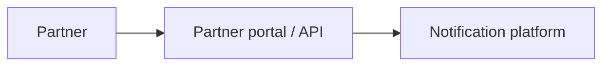

# Partner onboarding

Documents how a partner onboards onto the notification system.

## Scope (draft)

- **Organization** — Legal or display name, identifiers as assigned by the platform.
- **Primary contact email** — Main operational contact; used for critical comms and recovery where applicable.
- **Additional profile fields** — To be enumerated (billing, technical contact, region, compliance flags, …).
- **Metadata** — Audit fields, source system references, tags, custom key-value pairs as agreed.

## Diagrams

Link level-specific flows from [Technical flows overview](../technical-flows/index.md) as they are authored (for example the onboarding sequence under [level 2](../technical-flows/level-2/l2-onboarding-sequence/index.md)).

### Placeholder context (inline Mermaid)

